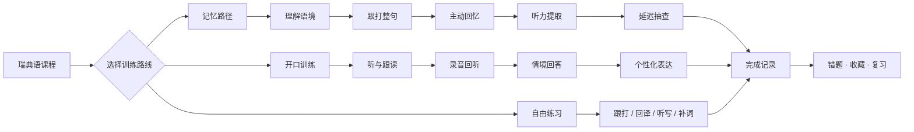
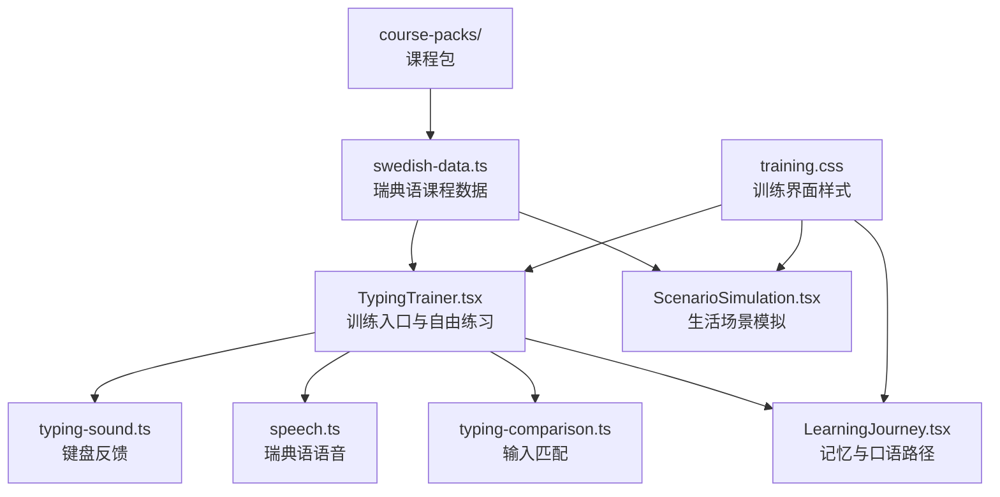

<p align="center">
  
</p>

<h1 align="center">hej! Swedish Training</h1>

<p align="center">
  中文 | <a href="README_EN.md">English</a>
</p>

<p align="center">
  用键盘、声音和生活场景练习瑞典语。
</p>

<p align="center">
  
  
  
  
  
</p>

`hej!` 的瑞典语训练模块。同一个表达会在整句输入、主动回忆、听力和开口练习中反复出现。

## 功能

- 看词跟打、中文回译、听音辨词和例句补词
- 整句提交后按单词定位错误，不在输入过程中提前揭晓答案
- 理解、跟打、主动回忆、听力提取和延迟抽查组成的记忆路径
- 跟读、录音、回听、情境回答和个性化表达组成的开口训练
- 咖啡店、交通、医疗、工作等瑞典生活场景模拟
- 瑞典语课程数据和 1,000 句日常表达课程包
- `a` 兼容 `å / ä`、`o` 兼容 `ö`，同时接受正确的瑞典字母
- 浏览器语音、键盘音效、错题回调、收藏和练习进度

## 训练流程



## 模块关系



## 技术栈

| 部分 | 技术 | 用途 |
| --- | --- | --- |
| 组件 | React 18 | 训练状态、交互和界面组合 |
| 类型 | TypeScript | 课程、词句、进度和组件接口 |
| 语音 | Web Speech API | 瑞典语单词和整句朗读 |
| 录音 | MediaRecorder API | 跟读录音与回听 |
| 音效 | Web Audio API | 键盘与答题反馈音效 |
| 动画 | Canvas Confetti | 训练完成反馈 |
| 图标 | Lucide React | 训练界面图标 |
| 数据 | JSON + TypeScript | 课程包和内容结构 |
| 存储 | localStorage | 练习进度和未完成训练恢复 |
| 样式 | CSS | 桌面端与移动端训练界面 |

## 目录

```text
src/
├── course-packs/
│   ├── premium-daily-1000.json
│   └── schema.ts
├── TypingTrainer.tsx
├── LearningJourney.tsx
├── ScenarioSimulation.tsx
├── swedish-data.ts
├── typing-comparison.ts
├── typing-sound.ts
├── speech.ts
├── i18n.tsx
├── learning-language.tsx
├── KineticLoader.tsx
└── training.css
```

## 主要组件

### TypingTrainer

训练入口和键盘练习主体。负责路线选择、练习模式、难度、整句输入、错误定位、课程完成和训练恢复。

### LearningJourney

记忆路径与开口训练。记忆路径按照四个表达一组组织训练；开口训练加入录音、回听、情境迁移和自由表达。

### ScenarioSimulation

瑞典生活场景练习。通过选择、排序和填空推进对话，并在浏览器本地保存场景完成情况。

### Course Packs

`schema.ts` 定义课程包结构并校验 JSON 数据。`premium-daily-1000.json` 包含 50 课、1,000 条日常瑞典语表达。

## License

[GNU General Public License v3.0](LICENSE)
