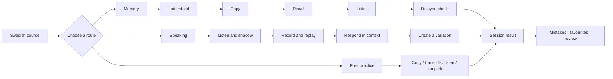

<p align="center">
  
</p>

<h1 align="center">hej! Swedish Training</h1>

<p align="center">
  <a href="README.md">中文</a> | English
</p>

<p align="center">Practice Swedish through typing, sound, and everyday situations.</p>

<p align="center">
  
  
  
  
  
</p>

The Swedish training modules used in `hej!`. Each expression returns through whole-sentence typing, active recall, listening, and speaking instead of appearing as an isolated vocabulary item.

## Features

- Copy typing, Chinese-to-Swedish recall, listening, and sentence completion
- Whole-sentence submission with word-level error location
- Memory training through context, copying, active recall, listening extraction, and delayed checks
- Speaking practice with shadowing, recording, playback, situational responses, and personalised variations
- Simulations based on everyday situations in Sweden
- Swedish course data and a 1,000-expression daily-language course pack
- Plain-key fallbacks: `a` for `å / ä` and `o` for `ö`
- Browser speech, keyboard feedback, mistake callbacks, favourites, and resumable sessions

## Training Flow



## Tech Stack

| Area | Technology | Purpose |
| --- | --- | --- |
| Components | React 18 | Training state and interactions |
| Types | TypeScript | Course, phrase, progress, and component types |
| Speech | Web Speech API | Swedish word and sentence playback |
| Recording | MediaRecorder API | Speaking capture and replay |
| Sound | Web Audio API | Keyboard and answer feedback |
| Animation | Canvas Confetti | Completion feedback |
| Icons | Lucide React | Interface icons |
| Content | JSON + TypeScript | Course packs and schemas |
| Storage | localStorage | Progress and resumable sessions |
| Styling | CSS | Desktop and mobile training layouts |

## Source Layout

```text
src/
├── course-packs/
│   ├── premium-daily-1000.json
│   └── schema.ts
├── TypingTrainer.tsx
├── LearningJourney.tsx
├── ScenarioSimulation.tsx
├── swedish-data.ts
├── typing-comparison.ts
├── typing-sound.ts
├── speech.ts
├── i18n.tsx
├── learning-language.tsx
├── KineticLoader.tsx
└── training.css
```

## License

[GNU General Public License v3.0](LICENSE)
